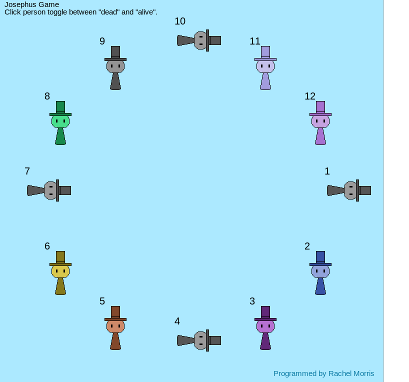
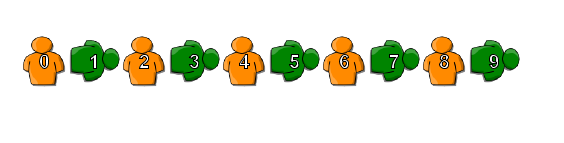
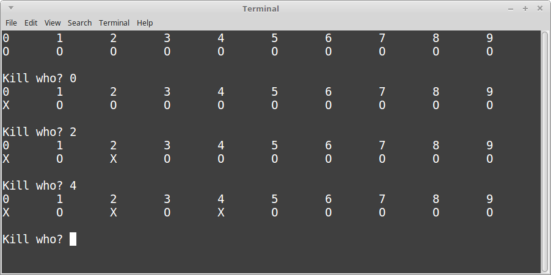

# Extra Credit - Josephus game

Implement the Josephus game in a tool or programming language of your choice.

Suggested tools:

* Greenfoot
* Python
* C++
* Java
* C#

---

## Requirements

**Teamwork:** 

You can work with up to **one other person** on this project.

**Characters:**

You should have some sort of representation of each person in the Josephus circle,
	both for their alive state and their dead state.

Each person should also have a numeric label associated with them.

There should be a separate representation for an "alive" person and a "dead" person.

For example:

*Josephus game in Greenfoot*

*Josephus game in C++*

**Toggle alive/dead:**

The program should allow the user to interact with it in order to
toggle between the "alive" and "dead" states of the characters.

In Greenfoot, this might be handling mouse clicks:

	if ( Greenfoot.mouseClicked( this ) ) { ... }

Or in a text-based language, you might just ask for the user
to type in the *index* of the person to kill/revive.

**Circle not required:**

You are not required to put the people in a circle.
They can be in a straight line instead.

**Dynamic sizing not required:**

You can hard-code one quantity of people for your "circle";
you do not have to ask the user how many people there should be.

**Upload:**

Once finished, zip up your entire project (source files, project files, etc.)
and submit them to the extra credit assignment dropbox.

