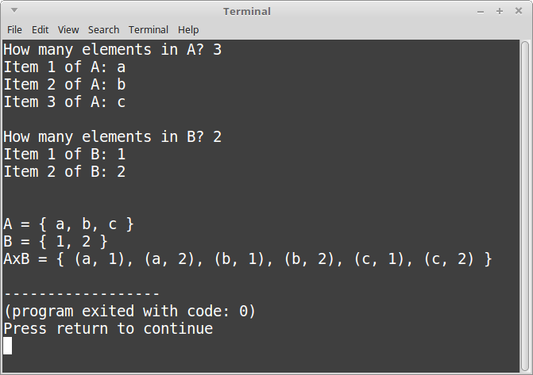

# Extra Credit - Cartesian Product

Implement a program that allows the user to build two sets,
and then find the Cartesian product of these sets

Use any language that you'd like.

---

## Requirements

**Teamwork:** 

You can work with up to **one other person** on this project.

**Any amount of elements:**

Allow the user to enter as many elements as they want. You should store
the set elements as **strings**.

*Hint: If you're using C++, you may want to use the [vector class](http://www.cplusplus.com/reference/vector/vector/).*

**Calculate AxB:**

You can utilize two for-loops - one nested in another - in order to build
your Cartesian product. Calculate the products and store them in a third Set.

**Easy to read:**

Make sure your program is easy to read as well. 

For example, to display the elements of a set, it might look like:

	void Display( const string& name, const vector<string>& thing )
	{
		cout << name << " = { ";
		for ( unsigned int i = 0; i < thing.size(); i++ )
		{
			if ( i != 0 ) { cout << ", "; }
			cout << thing[i];
		}
		cout << " }";
	}

**Upload:**

Once finished, zip up your entire project (source files, project files, etc.)
and submit them to the extra credit assignment dropbox.

