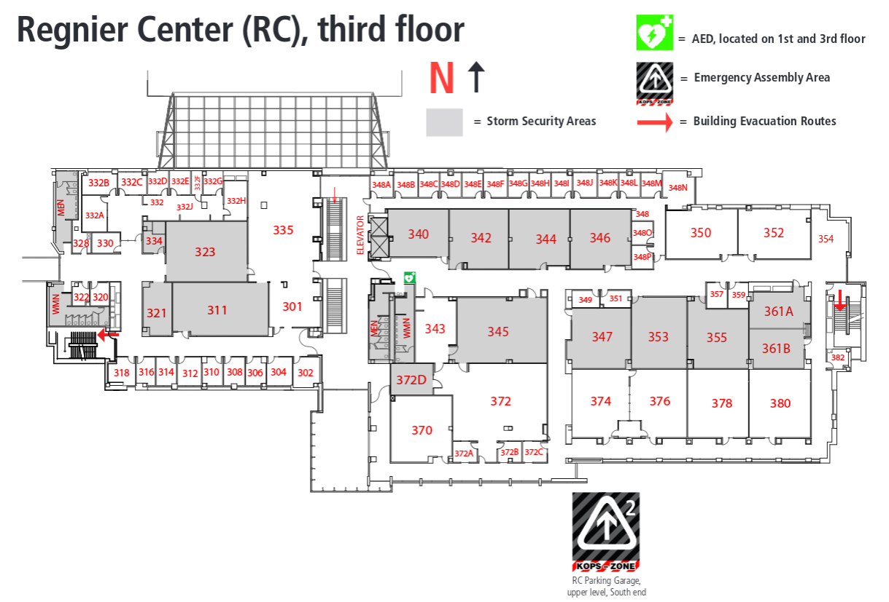

# CS 210: Discrete Structures I

## Course Information

* **Course:** CS 210
* **CRN:** xyz
* **Course Type:** Transfer
* **Prerequisites:** MATH 171 or both MATH 116 and CS 134 or appropriate math assessment scores.
* **Credits:** 3
* **Class Schedule:**
* **Catalog:** [http://catalog.jccc.edu/coursedescriptions/cs/#CS_210](http://catalog.jccc.edu/coursedescriptions/cs/#CS_210)

### Course Description

Upon successful completion of this course, the student should be able to use fundamental discrete mathematics as it relates to computers and computer applications. The student will be exposed to a variety of discrete mathematical topics. The course will include fundamental mathematical principles, combinatorial analysis, mathematical reasoning, graphs and trees, and Boolean logic circuits. 3 hrs. lecture/wk.

## Instructor Information

* **Instructor:** Rachel J Morris
* **JCCC Email:** rmorri38@jccc.edu
* See D2L for additional contact information
* **Office Location:** RC 330

**Office Hours, Spring 2017:**

<table>
	<tr>
	<th>Monday</th>
	<th>Tuesday</th>
	<th>Wednesday</th>
	<th>Thursday</th>
	</tr>
	<tr>
	<td></td> <!-- Monday -->
	<td></td> <!-- Tuesday -->
	<td></td> <!-- Wednesday -->
	<td></td> <!-- Thursday -->
	</tr>
</table>

Or by appointment.

## Class Supplies

**Textbook**

Discrete Mathematics: Mathematical Reasoning and Proof with Puzzles, Patterns, and Games 1st Edition

by Douglas E Ensley and J Winston Crawley

ISBN-13: 978-0471763802 

**Other**

A simple calculator - graphing calculators are **not allowed** on exams.

## Assessment

* Final Exam: 20%
* Chapter 1: 20%
* Chapter 2: 20%
* Chapter 3: 20%
* Chapter 4: 20%

For each chapter, the following assessments have the following weights:

* Exam: 50%
* Homework Problems: 10%
* Homework Quiz: 10%
* In-class Exercise: 10%
* In-class Quiz: 20%

### Grading Criteria

* A: 90 - 100%
* B: 80 - 89%
* C: 70 - 79%
* D: 60 - 69%
* F: 0 - 59%

## Course Format

The format of this course is pretty consistent each week. Every week, we will cover a certain number of sections, and once we've covered an entire chapter, we will have an exam.

Each week we will have:

1. Online video lectures over the sections
2. In-class group exercises to practice with the topics
3. Textbook homework problems assigned, due the next week
4. Online homework quiz assigned, due the next week
5. An in-class quiz during class the following week

It is important to get the work done. If you're running low on time, at least turn in your partial work; multiple 0%s on assignments will quickly bring your grade down!

### Textbook Homework

All textbook homework will be turned in digitally via Desire2Learn. You can either type out your answers or scan/photograph your homework and turn that in. There are resources on D2L on how to type with math notation.

## Course Policies

### Attendance

* Doing the weekly in-class quiz will count as your attendance record. If you miss a class or do not make it to class in time for the quiz, you miss out on those points.

### Late Assignments

* Late assignments will be accepted only during the week that they are due, with the maximum possible points being cut each day. After one week, I will not grade the late assignment.
	* 24 hours late: Max score is 90%
	* 48 hours late: Max score is 80%
	* 36 hours late: Max score is 70%
	* (And so on)

### Academic Honesty Guidelines

Each assignment will specify the rules for working on it, but by default you should assume that all assignments are an individual effort.

You can brainstorm with other students on general things, such as where to look in the book, or an example of solving a similar problem, but *copying assignments* or helping another student write their assignment is not allowed.

There are some assignments in class that will be group assignments, with one assignment turned in per group. These will be specified ahead of time.

If unsure about whether something is allowed - ask.

In general...

* Can:
	* Help other students with problems out of the textbook, examples in the chapter, etc.
	* Brainstorm with others on approaches to solve a problem.
	* Use reference material from the textbook, D2L, or other resources to help you with your assignments.
	* Sharing non-assignment work with others to get an idea of how a concept works.
* Cannot:
	* Sit with a student and tell them what to write, step-by-step.
	* Give another student your assignment, for them to reference or copy.
	* Write an assignment for somebody else.
	* Copying homework from off the internet for your assignment.

Also see the Student Code of Conduct Policy for more: [http://www.jccc.edu/about/leadership-governance/policies/students/student-code-of-conduct/student-code-conduct.html](http://www.jccc.edu/about/leadership-governance/policies/students/student-code-of-conduct/student-code-conduct.html)

### Getting Help

Feel free to ask questions any time during class, office hours, or even outside of normal school hours. I will respond as quickly as possible, and many questions end up being pretty simple and can get a response quickly.

If the normal office hours do not work for you, you can also request to meet on campus at a different time.

There are plenty of resources available online. A simple Google search or YouTube search may be what you need to find something that you're having trouble with. Feel free to use these resources for additional experience, but adhere to the **Academic Honesty policy** – *don't* copy someone else's work!

### Objectives and Expectations - CS 210

**Teacher's Objectives**

1. To help students build a solid foundation in problem solving and logic concepts.
2. To be an available resource, as a programmer and as a professional.
3. To provide multiple learning resources of different styles, as each student learns differently.
4. To advise and assess fairly. To help students understand how they earned their grade.
5. To assign fair assignments and make sure students have what they need prior to those assignments.
6. To keep an eye out for academic dishonesty. You don't learn if you don't do the work.
7. To return graded assignments and feedback promptly.

**Expectations of Students**

1. Students will be responsible for coming to class, reading the textbook and online resources, as they see fit. If you feel comfortable with the content without reading everything – good. If you're struggling, it is your responsibility to go over the content and ask for additional help.
2. Students will be responsible for turning in their assignments by the due date.
3. Students are responsible for notifying the teacher if there will be an extended absence, or if any accommodations may be needed.
4. Students will be respectful toward their peers and their instructor. They will not antagonize or demean others for their questions, experience level, field of study, or any other reason.
5. Students will make an effort to write cleanly, clearly, legibly, etc. on their homework, quizzes, and exams.
6. Students will follow the academic honesty policy of JCCC and this class.

## Tentative Course Schedule

### Important dates, Spring 2017

### General schedule

## Additional Information

### Student Handbook

[http://www.jccc.edu/student-resources/student-handbook.html](http://www.jccc.edu/student-resources/student-handbook.html) 

### Student Code of Conduct Policy

[http://www.jccc.edu/about/leadership-governance/policies/students/student-code-of-conduct/student-code-conduct.html](http://www.jccc.edu/about/leadership-governance/policies/students/student-code-of-conduct/student-code-conduct.html)

### College Emergency Response Plan

[http://www.jccc.edu/student-resources/police-safety/police-department/college-emergency-response-plan/index.html](http://www.jccc.edu/student-resources/police-safety/police-department/college-emergency-response-plan/index.html)

RC third floor Emergency Response Plan ([http://www.jccc.edu/about/campus/maps/files/pdf/rc3-emergency.pdf](http://www.jccc.edu/about/campus/maps/files/pdf/rc3-emergency.pdf)) detailed emergency instructions with storm security locations.
During a weather emergency individuals should seek shelter in the interior most portion of the building away from exterior windows and doors.

#### RC Storm Security Areas

* RC 331, 321, 323, 334
* RC 340, 342, 344, 345, 346, 347
* RC 353, 355
* RC 361A, 361B
* RC 372D
* Mens' and Womens' restrooms

### Academic Dishonesty

No student shall attempt, engage in, or aid and abet behavior that, in the judgment of the faculty member for a particular class, is construed as academic dishonesty. This includes, but is not limited to, cheating, plagiarism or other forms of academic dishonesty.

Examples of academic dishonesty and cheating include, but are not limited to, unauthorized acquisition of tests or other academic materials and/or distribution of these materials, unauthorized sharing of answers during an exam, use of unauthorized notes or study materials during an exam, altering an exam and resubmitting it for re-grading, having another student take an exam for you or submit assignments in your name, participating in unauthorized collaboration on coursework to be graded, providing false data for a research paper, using electronic equipment to transmit information to a third party to seek answers, or creating/citing false or fictitious references for a term paper. Submitting the same paper for multiple classes may also be considered cheating if not authorized by the faculty member.

Examples of plagiarism include, but are not limited to, any attempt to take credit for work that is not your own, such as using direct quotes from an author without using quotation marks or indentation in the paper, paraphrasing work that is not your own without giving credit to the original source of the idea, or failing to properly cite all sources in the body of your work. This includes use of complete or partial papers from internet paper mills or other sources of non-original work without attribution.

A faculty member may further define academic dishonesty, cheating or plagiarism in the course syllabus.

### ADA Compliance / Disabilities

JCCC provides a range of services to allow persons with disabilities to participate in
educational programs and activities. If you are a student with a disability and if you are in
need of accommodations or services, it is your responsibility to contact Access Services and
make a formal request. To schedule an appointment with an Access Advisor or for additional
information, you can contact Access Services at (913) 469-3521 or accessservices@jccc.edu.
Access Services is located on the 2nd floor of the Student Center (SC202).

## Catalog Information

Information from [http://catalog.jccc.edu/coursedescriptions/cs/#CS_210](http://catalog.jccc.edu/coursedescriptions/cs/#CS_210)

### Course Objectives

Apply the mathematical tools and techniques basic to and needed for most courses in computer science
 
1. Develop the ability to reason precisely using discrete mathematics models 
2. Apply the relationship between discrete mathematics and computer science 
3. Apply the elements of logic to computer science 
4. Write the truth table of a proposition 
5. Demonstrate how a proposition is used in computer science 
6. Apply combinatorial circuits and their use in computer science 
7. Demonstrate how to simplify Boolean expressions and their use in computer science 
8. Apply the elements of set theory and related topics to computer science 
9. Demonstrate Cartesian product and their use in computer science 
10. Demonstrate sequences and their use in computer science 
11. Demonstrate mathematical induction and its use in computer science 
12. Demonstrate matrices and their use in computer science 
13. Demonstrate graphs and their use in computer science 
14. Demonstrate trees and their use in computer science 
15. Demonstrate proofs and arguments and their use in computer science   

### Content Outline and Competencies

<pre>
I. Introduction
   A. Determine whether a solution is possible in a variety of
circumstances
   B. Count the number of solutions in a variety of circumstances
   C. Optimize a solution in a variety of circumstances
   D. Create PERT charts
   E. Find the critical path for a PERT chart

II. Sets
   A. Define a set and related properties
   B. Use operations with sets
   C. Use Venn Diagrams  with sets
   D. Use DeMorgan's Law
   E. Use the Cartesian Product

III. Equivalence Relations
   A. Define an equivalence relation
   B. Find if a relation has the reflexive property
   C. Find if a relation has the symmetic property
   D. Find if a relation has the transitive property
   E. Define and use partitions

IV. Congruence Classes
   A. Define a congruence class and related properties
   B. Do arithmetic operations using congruence classes

V. Functions
   A. Define a function and related properties
   B. Define one-to-one and related properties
   C. Define onto and related properties
   D. Define composition and related properties

VI.   Define and use the concepts of Mathematics Induction

VII. Graphs
   A. Define a graph and related properties
   B. Define a matrix and related properties
   C. Add matrices
   D. Subtract matrices
   E. Do scalar multiplication
   F. Do matrix multiplication
   G. Represent a graph as a graph, an adjacency list, and a matrix
   H. Change from any representation of a graph to another form
   I. Define and use the concept of isomorphisms
   J. Define a path and related properties for a graph
   K. Define a circuit and related properties for a graph
   L. Find Euler paths and circuits for a graph
   M. Find Hamiltonian paths and cycles for a graph
   N. Find the shortest path between any two points in a graph
   O. Color a map
   P. Find the graph of a map
   Q. Define a digraph and related properties
   R. Represent a digraph as a graph, an adjacency list, and a matrix
   S. Change the representation of a digraph from any representation of a
graph to another form
   T. Find the Euler paths and circuits for a digraph
   U. Find Hamiltonian paths and cycles for a digraph

VIII. Trees
   A. Define a tree and related properties
   B. Create a spanning tree for a graph
   C. Create a minimum spanning tree for a graph
   D. Create a maximum spanning tree for a graph
   E. Create a depth-first search spanning tree for a graph
   F. Create a breadth-first search spanning tree for a graph
   G. Define a rooted tree and related properties
   H. Define a binary tree and related properties
   I. Create an expression tree for a preorder, postorder, and inorder
expression
   J. Evaluate a preorder, postorder, and inorder expression
   K. From a tree, write the preorder, postorder, and inorder expression
   L. Develop an optimal tree using Huffman Code
   M. Develop and use a binary search tree

IX. Matching Problems
   A. Use systems of distinct representations to solve a variety of
problems
   B. Apply the algorithms of maximal independent sets to solve a variety
of problems

X. Network Flows
   A. Define a transportation network and related properties
   B. Maximize a transportation network
   C. Find a cut for an optimal transportation network 

XI. Counting Techniques
   A. Use the product rule
   B. Use the sum rule
   C. Use the Pigeonhole Principle
   D. Use the notation for permutations and combinations
   E. Use combinations
   F. Use permutations
   G. Use the principle of inclusion-exclusion

XII. Combinatorial Circuits
   A. Define AND, OR, and NOT gates and their related properties
   B. Use logical gates to create circuits
   C. Find the Boolean expression of a circuit
   D. Find the truth table for a Boolean expression
   E. Use Karnaugh maps to optimize a circuit or a logical expression

</pre>

### Method of Evaluation and Competencies

A minimum of 4 examinations            at least 60%

A minimum of 10 quizzes                at least 10%

A minimum of 10 homework assignments   at least 10%
                                               
100%

### Grade Criteria

A = 90%
B = 80%     
C = 70%     
D = 60%     
F = less than 60%

### Caveats

-

### Student Responsibilities

-