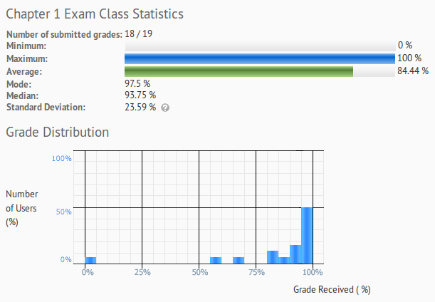

# Exam 1 Stats, Spring 2017

There were four versions of Exam 1 - two for the Day session,
and two for the Night session.

---

# Overall stats

## Day session

* A's: 12
* B's: 3
* C's: 0
* D's: 1
* F's: 2

## Night session

* A's: 1
* B's: 0
* C's: 0
* D's: 0
* F's: 0

---

# Question breakdown

## Day session

<table>
	<tr>
		<th>Question #</th>
		<th>MEAN Score (Average)</th>
		<th>MEDIAN Score (Middle)</th>
		<th>MODE Score (Most often repeated)</th>
	</tr>
	
	<tr>
		<td>Question 1</td>
		<td>	3.53	</td> <!-- mean -->
		<td>	4	</td> <!-- median -->
		<td>	4	</td> <!-- mode -->
	</tr>
	
	<tr>
		<td>Question 2</td>
		<td>	3.76	</td> <!-- mean -->
		<td>	4	</td> <!-- median -->
		<td>	4	</td> <!-- mode -->
	</tr>
	
	<tr>
		<td>Question 3</td>
		<td>	3.76	</td> <!-- mean -->
		<td>	4	</td> <!-- median -->
		<td>	4	</td> <!-- mode -->
	</tr>
	
	<tr>
		<td>Question 4</td>
		<td>	3.94	</td> <!-- mean -->
		<td>	4	</td> <!-- median -->
		<td>	4	</td> <!-- mode -->
	</tr>
	
	<tr>
		<td>Question 5</td>
		<td>	3.53	</td> <!-- mean -->
		<td>	4	</td> <!-- median -->
		<td>	4	</td> <!-- mode -->
	</tr>
	
	<tr>
		<td>Question 6</td>
		<td>	3.53	</td> <!-- mean -->
		<td>	4	</td> <!-- median -->
		<td>	4	</td> <!-- mode -->
	</tr>
	
	<tr>
		<td>Question 7</td>
		<td>	3.53	</td> <!-- mean -->
		<td>	4	</td> <!-- median -->
		<td>	4	</td> <!-- mode -->
	</tr>
	
	<tr>
		<td>Question 8</td>
		<td>	3.35	</td> <!-- mean -->
		<td>	4	</td> <!-- median -->
		<td>	4	</td> <!-- mode -->
	</tr>
	
	<tr>
		<td>Question 9</td>
		<td>	2.41	</td> <!-- mean -->
		<td>	2	</td> <!-- median -->
		<td>	2	</td> <!-- mode -->
	</tr>
	
	<tr>
		<td>Question 10</td>
		<td>	3.24	</td> <!-- mean -->
		<td>	4	</td> <!-- median -->
		<td>	4	</td> <!-- mode -->
	</tr>
	
	<tr>
		<td>Question 11</td>
		<td>	3.71	</td> <!-- mean -->
		<td>	4	</td> <!-- median -->
		<td>	4	</td> <!-- mode -->
	</tr>
</table>

## Night session

<table>
	<tr>
		<th>Question #</th>
		<th>MEAN Score (Average)</th>
		<th>MEDIAN Score (Middle)</th>
		<th>MODE Score (Most often repeated)</th>
	</tr>
	
	<tr>
		<td>Question 1</td>
		<td>	asdf	</td> <!-- mean -->
		<td>	asdf	</td> <!-- median -->
		<td>	asdf	</td> <!-- mode -->
	</tr>
	
	<tr>
		<td>Question 2</td>
		<td>	asdf	</td> <!-- mean -->
		<td>	asdf	</td> <!-- median -->
		<td>	asdf	</td> <!-- mode -->
	</tr>
	
	<tr>
		<td>Question 3</td>
		<td>	asdf	</td> <!-- mean -->
		<td>	asdf	</td> <!-- median -->
		<td>	asdf	</td> <!-- mode -->
	</tr>
	
	<tr>
		<td>Question 4</td>
		<td>	asdf	</td> <!-- mean -->
		<td>	asdf	</td> <!-- median -->
		<td>	asdf	</td> <!-- mode -->
	</tr>
	
	<tr>
		<td>Question 5</td>
		<td>	asdf	</td> <!-- mean -->
		<td>	asdf	</td> <!-- median -->
		<td>	asdf	</td> <!-- mode -->
	</tr>
	
	<tr>
		<td>Question 6</td>
		<td>	asdf	</td> <!-- mean -->
		<td>	asdf	</td> <!-- median -->
		<td>	asdf	</td> <!-- mode -->
	</tr>
	
	<tr>
		<td>Question 7</td>
		<td>	asdf	</td> <!-- mean -->
		<td>	asdf	</td> <!-- median -->
		<td>	asdf	</td> <!-- mode -->
	</tr>
	
	<tr>
		<td>Question 8</td>
		<td>	asdf	</td> <!-- mean -->
		<td>	asdf	</td> <!-- median -->
		<td>	asdf	</td> <!-- mode -->
	</tr>
	
	<tr>
		<td>Question 9</td>
		<td>	asdf	</td> <!-- mean -->
		<td>	asdf	</td> <!-- median -->
		<td>	asdf	</td> <!-- mode -->
	</tr>
	
	<tr>
		<td>Question 10</td>
		<td>	asdf	</td> <!-- mean -->
		<td>	asdf	</td> <!-- median -->
		<td>	asdf	</td> <!-- mode -->
	</tr>
	
	<tr>
		<td>Question 11</td>
		<td>	asdf	</td> <!-- mean -->
		<td>	asdf	</td> <!-- median -->
		<td>	asdf	</td> <!-- mode -->
	</tr>
</table>

## Notes

Question 10

Phrasing isn't "If you got an extra life, then you collected 100 coins";
the cause would be "You got an extra life" and the result would be
"you got 100 coins". It isn't a simple rephrasing of the original problem.

Example

* Original: "If you collect a green mushroom, then you get an extra life."
* Contrapositive: "If you don't collect an extra life, then you don't collect a green mushroom."
* Incorrect: "If you don't get an extra life, then you *didn't* collect the green mushroom."

Predicates

Too many people tried to write statements like "x is divisible by 3" symbolically. **These are supposed to be written out in English**, such as:

	P(x) is the predicate x is divisible by 3
	
We **never covered how to write a number as divisible by 3, or even, or odd** - that is in Chapter 2. Using English to define the predicates is fine.

For reference, the definition of an even number *n* is:

	n = 2k

and an odd number *m* is:

	m = 2a + 1

and a number *o* that is divisible by 4:

	o = 4b

---

# Survey responses

## Day session

	Do you feel like you did well on the exam?
	* 10		Yes
	* 2			Decent, So-so
	* 1			Maybe, except for chapter 1.5
	* 1			Neutral
	
	Do you feel like you had enough resources to prepare for the exam?
	* 13		Yes
	* 1			Yes, but I didn't study enough

### Feedback

"It was okay I guess."

"Very good"

"I do well conceptually, the fact that some background information was on the test was really appreciated, after all, applying it is much more important than memorizing things I could look up."

"I believe the exam was perfectly aligned with the content so far."

"It was good and helpful"

"I like the formatting a lot!"

"It was organized and well made"

"I found having the terms and negations defined on the first page kind of defeated the point of memorizing."

"Good exam, it felt fair and it was well written."

"I wish it were more like the quizzes. The breakdown on those are wonderful. Overall, it was good."

"It was good."

"The exam was okay"

"I wish I was more prepared but overall it was good."

## Night session

	Do you feel like you did well on the exam?
	* 12		Yes
	* 1			I think I got above 85%
	* 1			Decent, So-so, okay
	* 2			I hope so
	* 1			Maybe, except for chapter 1.5
	* 1			No, I bombed it

	Do you feel like you had enough resources to prepare for the exam?
	* 17		Yes
	* 1			For the most part

### Feedback

"It was good"

"Good. Needed mastery of material to know, but resources helped."

"Exam was fair, and part I failed was my own fault for not (?can't read)"

"It was fine"

"I really appreciate the front page, it reassures me I remember some of the small differences like w/ the vocab."

"Good"

"On cheat sheet include negation of implication."

"♥"

"Exam was well organized"

"Pretty good, a little tricky"

"The test felt properly balanced"

"Your exam was cute! I thought question 6 in particular was really funny and made me smile!"

---
